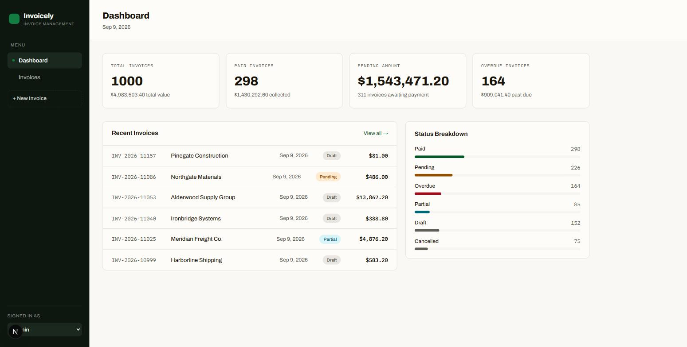

# Invoicely

An invoice management frontend: a metrics dashboard, a filterable/sortable
invoice table with bulk actions and CSV export, an invoice detail view, and a
create/edit form — with a simulated role switcher (Admin / Accountant / Viewer)
that gates destructive and editing actions.



**Live demo:** _deploy pending — see [Deployment](#deployment)._

## Features

| Brief | Where |
| --- | --- |
| Dashboard with key metrics | `/` — four KPI cards, recent invoices, status breakdown |
| Filterable / sortable listing | `/invoices` — search, multi-select status, issue-date range, sortable columns; all state in the URL |
| Server-side pagination | 1,000 seeded invoices; the client holds one page at a time |
| Invoice detail | `/invoices/[id]` — line items, totals, metadata, role-gated action row |
| Create / edit form | `/invoices/new`, `/invoices/[id]/edit` — one form, one shared zod schema |
| Bulk selection (bonus) | selection survives pagination; header checkbox toggles the page, indeterminate on partial |
| CSV export (bonus) | RFC 4180 escaping; exports the selection, or the whole filtered set |
| Role-based actions (bonus) | `can(role, action)` matrix drives every gated control and both form routes |
| Loading / error / empty states | every data-backed view |
| Printable invoice | `/invoices/[id]/print` — `@media print` stylesheet, opens the browser print dialog |

## Stack

- **Next.js (App Router) + TypeScript** — route handlers give an API boundary with no second server; routes give deep-linkable URLs.
- **Tailwind CSS + shadcn/ui**, re-themed to an OKLCH palette — the primitives supply keyboard and ARIA behaviour.
- **react-hook-form + zod** — one schema (`src/lib/schemas.ts`) validates the form and the write handlers, so client and server can't drift.
- **Framer Motion**, restrained — page fade-in, selection bar, toast, dialog; nothing on table rows.
- **Vitest + React Testing Library** for the focused test suite.

## Getting started

```bash
npm install
npm run dev        # http://localhost:3000
npm run build      # production build
npm run lint
npm test           # vitest
```

Requires Node 20+.

## Architecture

**Data access split.** Server components read the data source directly
(`src/server/store.ts`) for the initial render and `not-found` handling; every
client interaction — filtering, pagination, and all mutations — goes through the
REST route handlers under `/api/invoices` (`src/lib/api.ts` is the only place
that calls `fetch`). Server reads hitting the source directly and client writes
crossing the REST boundary is the idiomatic App Router split; with real auth the
`can()` matrix would also be enforced in the handlers.

**Server-side query handling.** `store.filterSort()` applies search, status,
date-range and sort; `store.query()` then paginates it. The list endpoint and
the dedicated export endpoint share `filterSort`, so filter semantics can't
diverge. The client sends one page's worth of rows over the wire at a time.

**URL as state.** The listing keeps search, filters, sort, page and page-size in
`searchParams` (`useTableQuery`). `router.replace` + `scroll: false`; filter and
page-size changes reset to page 1. A filtered URL reproduces the exact view in a
new tab, and leaving for a detail view and coming back keeps the filters.

**Validation.** `invoiceInputSchema` in `src/lib/schemas.ts` is the single
source of truth. The form consumes it via `zodResolver`; the POST and PATCH
handlers derive from the same `invoiceFields` base. Handler rejections come back
as a flattened message plus a `fields` map keyed to react-hook-form names.

**Permissions.** `src/lib/permissions.ts` holds `can(role, action)`. `RoleProvider`
persists the selected role to `localStorage` and exposes a `hydrated` flag;
role-gated controls render nothing until it is read, so a viewer never sees a
flash of an admin control. The `/invoices/new` and `/invoices/[id]/edit` routes
are wrapped in `PermissionGate`, not just visually hidden.

## Scope decisions & limitations

- **In-memory store.** Data lives in `globalThis` for the dev-server / running
  process; mutations persist until it restarts, then the deterministic seed
  regenerates. No database, ORM, or separate API server — the route handlers
  are the API boundary.
- **No auth.** The role selector is an explicit demo control. Because there is
  no auth, the API cannot enforce roles; permissions are enforced in the UI
  layer (see Architecture).
- **Seed anchor.** `TODAY` is computed from the real date at module load, so the
  "overdue" / "due soon" window slides forward with real time while
  `mulberry32(42)` keeps the dataset shape identical run to run.
- **USD, `en-US`, 8% tax** throughout.
- **Artificial API latency** (180–420ms in development, ~80ms in production) so
  loading and skeleton states are observable.

## Performance & accessibility

- Server-side filter / sort / pagination means the client never holds more than
  one page, so the listing stays smooth at 1,000 rows.
- Sortable headers are real `<button>`s inside `<th>` carrying `aria-sort`; rows
  stay proper table rows with a real link in the invoice-number cell (not a
  `role="link"` override). Skip link, visible focus rings on every control,
  labelled icon-only buttons, `aria-live` on the result-count region, focus-trapping
  dialogs.
- Responsive: sidebar collapses to a sheet below `lg`; the listing becomes a
  card list below `md` with sorting in a select; the KPI grid reflows 4 → 2 → 1.
- All motion honours `prefers-reduced-motion` (`MotionConfig` + a global media
  query).
- **Lighthouse accessibility: 100** on `/`, `/invoices`, `/invoices/[id]` and
  `/invoices/new`.

## Deployment

Deploy to Vercel (zero config — it detects Next.js):

```bash
npx vercel        # first run prompts for login + project linking
npx vercel --prod
```

Then paste the production URL into the **Live demo** line above.
